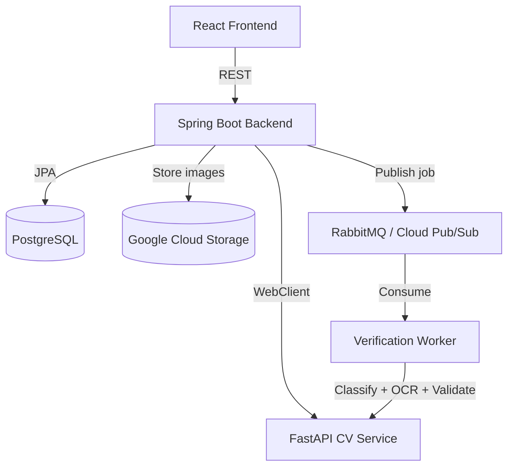

# VeriKYC


An AI-powered KYC document verification system. Upload a PAN card, Aadhaar, Passport, Driving License, or Cheque — VeriKYC classifies the document type, extracts text fields via OCR, validates the data, and matches the face against a selfie.

| Repo | Description |
|------|-------------|
| [verikyc-backend](https://github.com/veriKYC/verikyc-backend) | Spring Boot REST API — auth, document management, CV orchestration |
| [verikyc-cv](https://github.com/veriKYC/verikyc-cv) | FastAPI ML service — EfficientNet classification, PaddleOCR, field validation, face matching |
| [verikyc-frontend](https://github.com/veriKYC/verikyc-frontend) | React SPA — upload flow, processing status, results page, dashboard |
| [verikyc-infra](https://github.com/veriKYC/verikyc-infra) | Docker Compose, GCP deployment scripts, Terraform configs |

---

## Why this project

Manual KYC is slow, inconsistent, and expensive. This system automates the full pipeline — from raw image upload to a structured, confidence-scored verification result — using a microservices architecture backed by deep learning models.

Built end-to-end as a portfolio project: API design, ML training, frontend, containerisation, and cloud deployment all done from scratch.

---

## Architecture



The backend owns orchestration — auth, document storage, and coordinating with the CV service. The CV service is stateless and has no database access. The frontend only ever talks to the backend.

---

## CV Pipeline

Six sequential stages. Classification runs first and gates everything downstream.

```
Upload → Classify → OCR → Validate → Face Match → Quality Check → Tamper Detection
```

| Stage | Model | What it produces |
|-------|-------|-----------------|
| Document Classification | EfficientNet-B0 (fine-tuned, ONNX) | Document type + confidence score |
| OCR Extraction | PaddleOCR + MRZ parser | Extracted fields per document type |
| Field Validation | Rules engine | PAN regex, Verhoeff checksum, IFSC, MRZ |
| Quality Check | MobileNetV3 | Blur / glare / crop rejection |
| Text Region Detection | CRAFT / DBNet | Bounding boxes for UI overlay |
| Face Matching + Liveness | RetinaFace + ArcFace + MiniFASNet | Similarity score, liveness, MATCH / MISMATCH |
| Tamper Detection | ELA + forensic CNN | Tamper probability, flagged regions |

---

## Verification Modes

**Quick Verify** — single document, selfie optional. Returns per-field extraction with confidence scores and a pass/fail verdict.

**KYC Session** *(Phase 3)* — multi-document session with mandatory selfie. Groups documents under a `SessionEntity` and returns a consolidated identity verification report with face matching across all photo-bearing documents.

---

## Tech Stack

| Layer | Technology |
|-------|-----------|
| Backend | Java 17 + Spring Boot 3.x + Spring Security + Spring Data JPA + WebFlux |
| CV / ML | Python 3.10 + FastAPI + PyTorch + EfficientNet-B0 + PaddleOCR + ArcFace + ONNX Runtime |
| Frontend | React 18 + Tailwind CSS + Axios + React Router |
| Database | PostgreSQL 15 — JSONB for extracted fields and confidence scores |
| Queue | RabbitMQ (local) / Cloud Pub/Sub (GCP) |
| Storage | Google Cloud Storage — signed URLs, 90-day lifecycle policy |
| Infra | Docker + Docker Compose + GCP Cloud Run + Cloud SQL + Artifact Registry |
| CI/CD | Google Cloud Build — triggered on push to dev branch |
| IaC | Terraform *(Phase 4)* |

---

## Running locally

```bash
git clone https://github.com/veriKYC/verikyc-infra
cd verikyc-infra
cp .env.example .env   # fill in DB credentials and JWT secret
docker compose up
```

| Service | URL |
|---------|-----|
| Backend API | http://localhost:8080 |
| Swagger UI | http://localhost:8080/swagger-ui |
| CV Service | http://localhost:8000/docs |
| Frontend | http://localhost:3000 |
| RabbitMQ UI | http://localhost:15672 |

---

## API

```
POST   /api/v1/auth/register
POST   /api/v1/auth/login

POST   /api/v1/documents/upload          # upload document + optional selfie
GET    /api/v1/documents/{id}            # status + document type
GET    /api/v1/documents/{id}/results    # extracted fields, confidence scores, validation
GET    /api/v1/documents                 # paginated list

PATCH  /api/v1/documents/{id}/cancel
PATCH  /api/v1/documents/{id}/review     # ADMIN / REVIEWER only
GET    /api/v1/admin/dashboard/stats     # ADMIN only
```

---

## Roadmap

- [x] Phase 1 — Foundation: backend, auth, document upload, CV classification
- [ ] Phase 2 — Quick Verify MVP: OCR, field validation, React frontend, Docker Compose
- [ ] Phase 3 — KYC Session: multi-doc, face matching, async pipeline, admin dashboard
- [ ] Phase 4 — Production: full GCP deployment, CI/CD automation, Terraform

---

## License

Portfolio and learning project.
